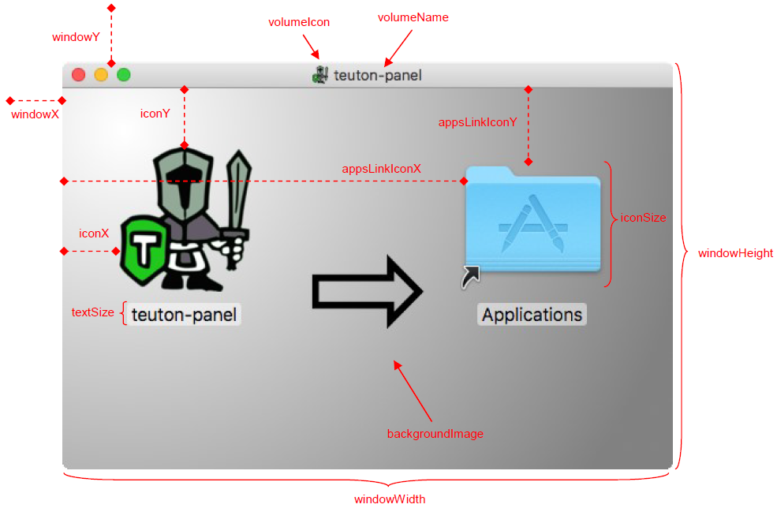

# Mac OS X specific properties

```xml
<macConfig>

	<!-- general properties -->
	<appId>app unique identifier</appId>
	<icnsFile>path/to/icon.icns</icnsFile>
	<generateDmg>true|false</generateDmg>
	<generatePkg>true|false</generatePkg>
	<relocateJar>true|false</relocateJar>
	
	<!-- signing properties -->
	<developerId>singning identity</developerId>
	<entitlements>path/to/entitlements.plist</entitlements>
	<codesignApp>true|false</codesignApp>
	
	<!-- properties used in DMG disk image generation -->
	<backgroundImage>path/to/png</backgroundImage>
	<windowX>x</windowX>
	<windowY>y</windowY>
	<windowWidth>width</windowWidth>
	<windowHeight>height</windowHeight>
	<iconSize>size</iconSize>
	<textSize>size</textSize>
	<iconX>x</iconX>
	<iconY>y</iconY>
	<appsLinkIconX>x</appsLinkIconX>
	<appsLinkIconY>y</appsLinkIconY>
	<volumeIcon>path/to/icns</volumeIcon>
	<volumeName>${name}</volumeName>
	
</macConfig>
```

| Property       | Mandatory | Default value  | Description                                                  |
| -------------- | --------- | -------------- | ------------------------------------------------------------ |
| `icnsFile`     | :x:       | `null`         | Icon file.                                                   |
| `generateDmg`  | :x:       | `true`         | Enables DMG disk image file generation.                      |
| `generatePkg`  | :x:       | `true`         | Enables installation package generation.                     |
| `relocateJar`  | :x:       | `true`         | If `true`, Jar files are located in `Contents/Resources/Java` folder, otherwise they are located in `Contents/Resources` folder. |
| `appId`        | :x:       | `${mainClass}` | App unique identifier.                                       |
| `developerId`  | :x:       | `null`         | Signing identity.                                            |
| `entitlements` | :x:       | `null`         | Path to [entitlements](https://developer.apple.com/documentation/bundleresources/entitlements) file. |
| `codesignApp`  | :x:       | `true`         | If it is set to `false`, generated app will not be codesigned. |

## DMG generation properties

| Property          | Mandatory | Default value                   | Description                                                |
| ----------------- | --------- | ------------------------------- | ---------------------------------------------------------- |
| `backgroundImage` | :x:       | `classpath:/mac/background.png` | DMG background  image.                                     |
| `windowX`         | :x:       | `10`                            | X coordinate of DMG window.                                |
| `windowY`         | :x:       | `50`                            | Y coordinate of DMG window.                                |
| `windowWidth`     | :x:       | `540`                           | Width of DMG window.                                       |
| `windowHeight`    | :x:       | `360`                           | Height of DMG window.                                      |
| `iconSize`        | :x:       | `128`                           | DMG icons size.                                            |
| `textSize`        | :x:       | `16`                            | DMG text size.                                             |
| `iconX`           | :x:       | `52`                            | X coordinate of bundled app icon. Relative to DMG window.  |
| `iconY`           | :x:       | `116`                           | Y coordinate of bundled app icon. Relative to DMG window.  |
| `appsLinkIconX`   | :x:       | `360`                           | X coordinate of Applications link. Relative to DMG window. |
| `appsLinkIconY`   | :x:       | `116`                           | Y coordinate of Applications link. Relative to DMG window. |
| `volumeIcon`      | :x:       | `${icon}`                       | Bundled app icon in ICNS format.                           |
| `volumeName`      | :x:       | `${displayName}`                | Volume name *(:warning: whitespaces are removed)*.         |


